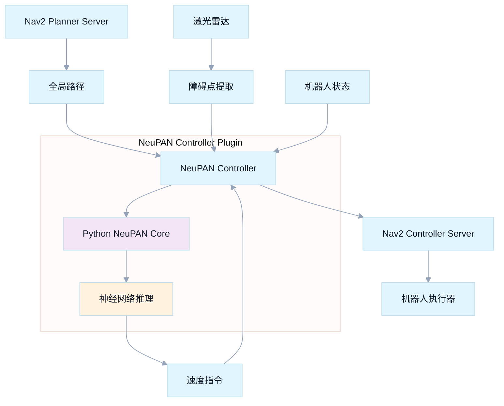

# NeuPAN Nav2 Controller Plugin

<div align="center">

[](https://docs.ros.org/en/humble/)
[](https://navigation.ros.org/)
[](https://www.iso.org/standard/68564.html)
[](https://www.python.org/)
[](LICENSE)

<br/>
<strong>🧠 神经网络路径跟踪控制器 · Nav2 插件</strong>
<br/>
<em>将 NeuPAN 神经网络路径规划器无缝集成到 ROS 2 Navigation 框架中</em>

</div>

---

<div align="center">

<a href="#-快速安装"></a>
<a href="#️-配置使用"></a>
<a href="#-高级配置"></a>
<a href="#-故障排除"></a>

</div>

<br/>

<div align="center">
  
</div>

<details>
<summary><strong>📚 目录</strong></summary>

- [📖 项目概述](#-项目概述)
- [✨ 核心特性](#-核心特性)
- [🏗️ 架构设计](#️-架构设计)
- [📦 系统要求](#-系统要求)
- [🚀 快速安装](#-快速安装)
- [⚙️ 配置使用](#️-配置使用)
- [🔧 高级配置](#-高级配置)
- [🧪 测试验证](#-测试验证)
- [📊 性能指标](#-性能指标)
- [🚨 故障排除](#-故障排除)
- [🔬 API 参考](#-api-参考)
- [🤝 贡献指南](#-贡献指南)
- [📝 版本历史](#-版本历史)
- [📚 相关资源](#-相关资源)
- [📄 许可证](#-许可证)
- [🙏 致谢](#-致谢)

</details>

## 📖 项目概述

**neupan_nav2_controller** 是一个专业的 ROS2 Nav2 控制器插件，它将 NeuPAN 神经网络路径规划算法完美集成到 Nav2 导航框架中。这个插件允许您在标准的 Nav2 环境中使用先进的端到端神经网络路径跟踪功能。

## ✨ 核心特性

### 亮点速览

| 🧠 智能控制 | 🔌 Nav2 集成 | 🛡️ 生产级 |
| --- | --- | --- |
| 端到端神经控制<br/>动态避障 | 标准插件接口<br/>生命周期管理 | Python/C++ 混合架构<br/>完备异常处理 |

### 🧠 智能控制算法
- **神经网络端到端控制** - 直接从激光雷达数据到控制指令
- **实时障碍物避免** - 基于点云的动态避障
- **多机器人支持** - 全向、差速驱动、阿克曼转向
- **高频控制输出** - 支持高达50Hz的控制频率

### 🔌 Nav2 完美集成
- **标准 Nav2 插件** - 完全兼容 Nav2 控制器接口
- **生命周期管理** - 支持 Nav2 节点生命周期
- **参数热重载** - 支持动态参数配置
- **可视化支持** - 集成 RViz 可视化

### 🛡️ 生产级特性
- **Python-C++ 混合架构** - 高性能与灵活性的完美结合
- **内存安全管理** - 专业的 Python C API 集成
- **异常处理** - 完整的错误处理和恢复机制
- **性能监控** - 内置性能指标和调试信息

## 🏗️ 架构设计



## 📦 系统要求

### 基础环境
- **Ubuntu 22.04** LTS
- **ROS2 Humble** Hawksbill  
- **Nav2** Navigation Framework
- **Python 3.10+** with NumPy
- **C++17** 编译器支持

### Python 依赖
```bash
# 核心依赖
pip3 install numpy torch
pip3 install neupan  # NeuPAN 核心算法包
```

## 🚀 快速安装

> 提示：以下示例默认在 Linux/ROS 2 Humble 环境中执行。

### 1. 创建工作空间
```bash
mkdir -p ~/nav2_ws/src
cd ~/nav2_ws/src
```

### 2. 克隆项目
```bash
git clone <your-repo-url> neupan_nav2_controller
cd ~/nav2_ws
```

### 3. 安装依赖
```bash
# 安装 ROS 依赖
rosdep install --from-paths src --ignore-src -r -y

# 安装 Python 依赖
pip3 install numpy torch neupan
```

### 4. 构建项目
```bash
colcon build --packages-select neupan_nav2_controller
source install/setup.bash
```

### 5. 验证安装
```bash
# 检查插件是否成功注册
ros2 pkg list | grep neupan_nav2_controller
```

## ⚙️ 配置使用

### Nav2 参数配置

在您的 Nav2 参数文件中添加 NeuPAN 控制器配置：

```yaml
controller_server:
  ros__parameters:
    controller_frequency: 20.0
    min_x_velocity_threshold: 0.001
    min_y_velocity_threshold: 0.5
    min_theta_velocity_threshold: 0.001
    failure_tolerance: 0.3
    progress_checker_plugin: "progress_checker"
    goal_checker_plugins: ["general_goal_checker"] 
    controller_plugins: ["FollowPath"]
    
    # NeuPAN 控制器配置
    FollowPath:
      plugin: "neupan_nav2_controller::NeuPANController"
      # 机器人类型: omni(全向) | diff(差速) | acker(阿克曼)
      robot_type: "omni"
      # 速度限制
      max_linear_velocity: 1.0
      max_angular_velocity: 1.5
      # 目标容差
      goal_tolerance: 0.3
      # 激光雷达话题
      laser_topic: "/scan"
```

### 启动配置

```bash
# 启动包含 NeuPAN 控制器的 Nav2
ros2 launch nav2_bringup navigation_launch.py \
    params_file:=/path/to/your/nav2_params.yaml
```

## 🔧 高级配置

### 机器人类型参数

#### 全向机器人 (omni)
```yaml
FollowPath:
  plugin: "neupan_nav2_controller::NeuPANController"
  robot_type: "omni"
  max_linear_velocity: 2.0  # m/s
  max_angular_velocity: 2.0  # rad/s
  # ⭐ 默认将优先使用包内模型与配置
  # 可显式覆盖：
  dune_model_path: "neupan_nav2_controller/model/omni_robot_default/model_5000.pth"
  neupan_config_path: "neupan_nav2_controller/vendor/NeuPAN-main/example/non_obs/omni/planner.yaml"
```

#### 差速驱动 (diff)
```yaml
FollowPath:
  plugin: "neupan_nav2_controller::NeuPANController"
  robot_type: "diff"  
  max_linear_velocity: 1.0  # m/s
  max_angular_velocity: 1.5  # rad/s
  dune_model_path: "neupan_nav2_controller/model/diff_robot_default/model_5000.pth"
  neupan_config_path: "neupan_nav2_controller/vendor/NeuPAN-main/example/non_obs/diff/planner.yaml"
```

#### 阿克曼转向 (acker)
```yaml
FollowPath:
  plugin: "neupan_nav2_controller::NeuPANController"
  robot_type: "acker"
  max_linear_velocity: 3.0   # m/s
  max_angular_velocity: 0.5  # rad/s (转向角)
  dune_model_path: "neupan_nav2_controller/model/acker_robot_default/model_5000.pth"
  neupan_config_path: "neupan_nav2_controller/vendor/NeuPAN-main/example/non_obs/acker/planner.yaml"
```

### 性能调优

```yaml
# 高性能配置
controller_server:
  ros__parameters:
    controller_frequency: 50.0  # 提高控制频率
    
    FollowPath:
      # 降低目标容差以提高精度
      goal_tolerance: 0.15
      # 优化激光雷达数据处理
      laser_downsample_rate: 2
      # 启用调试模式
      debug_mode: true
```

## 🧪 测试验证

### 基础功能测试
```bash
# 测试插件注册
python3 scripts/test_plugin_registration.py

# 测试控制器功能
python3 scripts/test_neupan_plugin.py

# 验证插件完整性
bash scripts/verify_plugin.sh
```

### 仿真环境测试
```bash
# 启动 Gazebo 仿真
ros2 launch neupan_nav2_controller neupan_nav2_test.launch.py

# 在 RViz 中设置目标点进行测试
# 观察控制器的路径跟踪和避障性能
```

## 📊 性能指标

| 指标 | 典型值 | 说明 |
|------|--------|------|
| **控制频率** | 20-50Hz | 取决于CPU性能 |
| **延迟** | <50ms | 从感知到控制指令 |
| **内存使用** | <200MB | 包含Python解释器 |
| **CPU使用** | 10-30% | 单核使用率 |
| **精度** | ±5cm | 典型路径跟踪精度 |

## 🚨 故障排除

### 常见问题（可展开）

<details>
<summary><strong>1) Python 模块导入失败</strong></summary>

```bash
# 检查 Python 路径
python3 -c "import sys; print('\n'.join(sys.path))"
# 确保 neupan 模块可访问
python3 -c "import neupan; print('NeuPAN imported successfully')"
```

</details>

<details>
<summary><strong>2) 控制器启动失败</strong></summary>

```bash
# 检查插件注册
ros2 plugin list | grep neupan_nav2_controller
# 查看详细日志
ros2 launch --debug nav2_bringup navigation_launch.py
```

</details>

<details>
<summary><strong>3) 性能问题</strong></summary>

```bash
# 监控资源使用
top -p $(pgrep -f controller_server)
# 调整控制频率
# 在参数文件中降低 controller_frequency
```

</details>

### 调试技巧

```bash
# 启用详细日志
export RCUTILS_LOGGING_SEVERITY=DEBUG

# 使用 RQT 监控话题
rqt_graph

# 检查 TF 变换
ros2 run tf2_tools view_frames
```

## 🔬 API 参考

### 主要接口

```cpp
class NeuPANController : public nav2_core::Controller
{
public:
  // 配置控制器
  void configure(...) override;
  
  // 计算速度指令
  geometry_msgs::msg::TwistStamped computeVelocityCommands(...) override;
  
  // 设置全局路径
  void setPlan(const nav_msgs::msg::Path & path) override;
  
  // 设置速度限制
  void setSpeedLimit(const double & speed_limit, const bool & percentage) override;
};
```

### 参数列表

| 参数名 | 类型 | 默认值 | 描述 |
|--------|------|--------|------|
| `robot_type` | string | "omni" | 机器人运动学类型 |
| `max_linear_velocity` | double | 0.5 | 最大线速度 (m/s) |
| `max_angular_velocity` | double | 1.0 | 最大角速度 (rad/s) |
| `goal_tolerance` | double | 0.25 | 目标容差 (m) |
| `laser_topic` | string | "/scan" | 激光雷达话题名称 |

## 🤝 贡献指南

我们欢迎社区贡献！请遵循以下步骤：

1. **Fork 项目**
2. **创建特性分支** (`git checkout -b feature/AmazingFeature`)
3. **提交更改** (`git commit -m 'Add some AmazingFeature'`)
4. **推送到分支** (`git push origin feature/AmazingFeature`)
5. **创建 Pull Request**

### 代码规范
- 遵循 ROS2 C++ 代码风格
- 添加充分的注释和文档
- 确保所有测试通过

## 📝 版本历史

- **v1.0.0** - 初始版本，基础控制器功能
- **v1.1.0** - 添加多机器人类型支持
- **v1.2.0** - 性能优化和稳定性改进
- **v1.3.0** - 增强的错误处理和调试功能

## 📚 相关资源

- **[NeuPAN 核心算法](https://github.com/hanruihua/neupan)** - 原始算法实现
- **[Nav2 文档](https://navigation.ros.org/)** - ROS2 导航框架
- **[ROS2 Humble 文档](https://docs.ros.org/en/humble/)** - ROS2 官方文档

## 📄 许可证

本项目基于 [GNU General Public License v3.0](LICENSE) 许可证开源。

## 🙏 致谢

- **NeuPAN 开发团队** - 提供核心算法
- **ROS2 Nav2 团队** - 提供导航框架

[⬆︎ 回到顶部](#neupan-nav2-controller-plugin)
---

<div align="center">

<strong>🌟 如果这个项目对您有帮助，请给个 Star！ 🌟</strong>

[报告问题](https://github.com/your-repo/issues) • [功能请求](https://github.com/your-repo/issues) • [技术讨论](https://github.com/your-repo/discussions)

</div>
